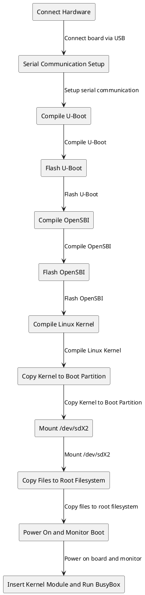

# kernel_programming
Reference: https://www.codingame.com/playgrounds/84444/running-u-boot-linux-kernel-in-qemu/pre-requisites 
## Summary of Setup and Execution Steps

### Overview

This guide walks through setting up a virtualized environment using QEMU to run a Linux kernel on a RISC-V architecture, leveraging U-Boot as the bootloader and Buildroot for toolchain generation. The tutorial covers installation of prerequisites, compilation, and execution steps for each component.

---

## Page 1: Introduction to Components
---
### Key Components
- **QEMU:** Emulator for creating virtual RISC-V hardware environments.
- **U-Boot:** Bootloader that initializes the virtual hardware and loads the Linux kernel.
- **RISC-V:** Target architecture for QEMU and the software stack.
- **Linux Kernel:** OS that runs on the virtualized RISC-V hardware.
- **Buildroot:** Tool for building cross-compilation toolchains and Linux system images.
- **OpenSBI:** Provides an interface between the Linux OS and RISC-V hardware for low-level tasks.

### Flow of Execution
1. **QEMU** emulates the RISC-V hardware environment.
2. **U-Boot** initializes the hardware and loads the Linux kernel.
3. **Buildroot** creates the toolchain and system image.
4. **OpenSBI** interfaces with RISC-V hardware, managing low-level operations.


### Flow of Execution
1. **Buildroot**: Cross-compiling toolchain.
2. **OpenSBI**: Firmware/first-stage bootloader.
3. **U-Boo**: Bootloader.
4. **Linux**: Kernel.
5. **BusyBox**: Root filesystem and utilities. contain Linux command

---
---
## Page 2: Setup on Ubuntu 20.04
---
### Install Prerequisites

```bash
sudo apt update && sudo apt install build-essential libncurses-dev rsync git ninja-build libglib2.0-dev libpixman-1-dev bison flex libssl-dev wget unzip bc file
```

### Directory Preparation

```bash
mkdir tech.io && cd tech.io
```

### Install Toolchain with Buildroot

```bash
wget https://buildroot.org/downloads/buildroot-2023.08.tar.gz
tar -xf buildroot-2023.08.tar.gz
cd buildroot-2023.08
make menuconfig
```

#### Configuration in Menuconfig:
**Select the following options:**
- **Target options**:
  - Target Architecture > **RISCV**
  - Target Architecture Size > **64-bit**
- **Toolchain**:
  - C library > **musl**
  - Kernel Headers > **Linux 6.4.x kernel headers**
  - Binutils Version > **binutils 2.41**
  - GCC compiler Version > **gcc 13.x**
Exit and save the configuration. Build the toolchain:

```bash
make sdk -j$(nproc)
cd ..
mkdir toolchain && cd toolchain
tar -xf ../buildroot-2023.08/output/images/riscv64-buildroot-linux-musl_sdk-buildroot.tar.gz
riscv64-buildroot-linux-musl_sdk-buildroot/relocate-sdk.sh

cd ..
printf "export PATH=~/tech.io/toolchain/riscv64-buildroot-linux-musl_sdk-buildroot/bin:\$PATH\n" > tech.io-env.sh
source tech.io-env.sh
```

### Verify Installation

```bash
riscv64-linux-gcc --version
```

---

## Page 3: Install QEMU
---
### Install via Package Manager (Recommended)

```bash
sudo apt update
sudo apt install qemu-user qemu-system
qemu-system-riscv64 --version
```

### Verify Supported Machines

```bash
qemu-system-riscv64 -M ?
```

---

# Example Day 1: Build Hello World by using
---
```bash
sudo apt install vim
cd /home/htritai/tech.io
vim hello.c
```
```c
// hello.c
#include <stdio.h>

int main() {
    printf("Hello, World!\n");
    return 0;
}
```

```bash
## Build hello.c
riscv64-linux-gcc -o hello hello.c -static
## Run hello
qemu-riscv64 hello
```
---
## Page 4: Install U-Boot
---
### Set Environment Variable

```bash
echo "export CROSS_COMPILE=riscv64-linux-" >> tech.io-env.sh
source tech.io-env.sh
```

### Build U-Boot

```bash
git clone https://source.denx.de/u-boot/u-boot.git
cd u-boot
git checkout v2023.07.02
make qemu-riscv64_smode_defconfig 
make -j$(nproc)
```
- qemu is simulated hardware
- riscv64: archtecture of hardware
- smode: S-Mode
- defconfig:

### Output
- **Binary Location:** `./u-boot.bin`

---

## Page 5: Install OpenSBI
---

### Build OpenSBI

```bash
git clone https://github.com/riscv-software-src/opensbi.git
cd opensbi
git checkout v1.2
make PLATFORM=generic FW_PAYLOAD_PATH=../u-boot/u-boot.bin -j$(nproc)
```

### Output
- **Firmware Location:** `build/platform/generic/firmware/fw_payload.elf`

---

## Page 6: Run U-Boot in QEMU
---
### Create QEMU Run Script

```bash
cd ~/tech.io
echo '#!/usr/bin/bash' > run-u-boot.sh
echo 'qemu-system-riscv64 -smp 2 \' >> run-u-boot.sh
echo '-m 1G \' >> run-u-boot.sh
echo '-nographic \' >> run-u-boot.sh
echo '-machine virt \' >> run-u-boot.sh
echo '-bios ./opensbi/build/platform/generic/firmware/fw_payload.elf' >> run-u-boot.sh
chmod +x run-u-boot.sh
```

### Run QEMU Script

```bash
./run-u-boot.sh
```

### Expected Output

```
U-Boot 2023.07.02 (Sep 28 2023 - 07:11:42 +0100)

CPU:   rv64imafdch_zicsr_zifencei_zihintpause_zba_zbb_zbc_zbs_sstc
Model: riscv-virtio,qemu
DRAM:  1 GiB
Core:  22 devices, 10 uclasses, devicetree: board
Flash: 32 MiB
Loading Environment from nowhere... OK
In:    serial@10000000
Out:   serial@10000000
Err:   serial@10000000
Net:   No ethernet found.
Working FDT set to bf7307d0
Hit any key to stop autoboot:  0

Device 0: unknown device
scanning bus for devices...

Device 0: unknown device
No ethernet found.
No ethernet found.
=>
```

---

## Page 7: Install Linux Kernel
---
### Environment Setup

```bash
echo "export ARCH=riscv" >> tech.io-env.sh
source tech.io-env.sh
```

### Build Linux Kernel

```bash
git clone https://git.kernel.org/pub/scm/linux/kernel/git/torvalds/linux.git
cd linux
git checkout v6.2
make defconfig
make -j$(nproc)
```

### Verify Build

```bash
grep --color=always -ni 'riscv' .config
ls arch/riscv/boot -lSh
```
If the configuration option `CONFIG_RISCV=y` is present, it indicates that the kernel was configured and built for RISC-V. This happens because the `ARCH` environment variable was set to `riscv` when the `.config` file was generated.
### Output Files

- **Image:** `arch/riscv/boot/Image`
- **Image.gz:** `arch/riscv/boot/Image.gz`

---

## Page 8: Create Disk Image
---
### Install `parted`

```bash
sudo apt-get update
sudo apt-get install -y parted
```

### Create Disk Image

```bash
cd ~/tech.io
dd if=/dev/zero of=disk.img bs=1M count=128
```

### Create Partitions

```bash
sudo parted disk.img mklabel gpt
sudo losetup --find --show --partscan disk.img # Check output: example /dev/loop11
sudo parted --align minimal /dev/loop11 mkpart primary ext4 0 50% # divide area
sudo parted --align minimal /dev/loop11 mkpart primary ext4 50% 100%
sudo mkfs.ext4 /dev/loop11p1 # format to ext4
sudo mkfs.ext4 /dev/loop11p2
sudo parted /dev/loop11 set 1 boot on # set region 1 to boot
```

### Copy Kernel to Disk

```bash
sudo mkdir /mnt/uboot
sudo mount /dev/loop11p1 /mnt/uboot
sudo cp linux/arch/riscv/boot/Image /mnt/uboot
sudo umount /mnt/uboot
# sudo losetup -d /dev/loop11 # maybe not use it
```

---

## Page 9: Modify QEMU Script
---
### Update `run-u-boot.sh`

```bash
#!/usr/bin/bash

qemu-system-riscv64 -smp 2 \
-m 1G \
-nographic \
-machine virt \
-bios ./opensbi/build/platform/generic/firmware/fw_payload.elf \
-blockdev driver=file,filename=./disk.img,node-name=disk \
-device virtio-blk-device,drive=disk
```

### Run QEMU Script

```bash
./run-u-boot.sh
```

### Verify Disk Detection
When the script runs, you should see output similar to the following, indicating that U-Boot has detected the disk:

```
...
Hit any key to stop autoboot:  0

Device 0: QEMU VirtIO Block Device
            Type: Hard Disk
            Capacity: 128.0 MB = 0.1 GB (262144 x 512)
... is now current device
Scanning virtio 0:1...
** File not found ubootefi.var **
Failed to load EFI variables
** Unable to write file ubootefi.var **
Failed to persist EFI variables
BootOrder not defined
EFI boot manager: Cannot load any image
scanning bus for devices...
...
---
```
---
## Page 10: Configure U-Boot for Kernel Boot
---
### Set U-Boot Boot Command

```bash
cd u-boot
make menuconfig
```
Inside ```Boot options```, set:
- **Boot Command:** `ext4load virtio 0:1 84000000 Image; booti 0x84000000 - ${fdtcontroladdr}`
- **Boot Arguments:** `root=/dev/vda2 rootwait console=ttyS0 earlycon=sbi`

### Rebuild U-Boot and OpenSBI

```bash
make -j$(nproc)
cd ../opensbi/
make PLATFORM=generic FW_PAYLOAD_PATH=../u-boot/u-boot.bin -j$(nproc)
cd ..
./run-u-boot.sh
```

### Outcome

- **U-Boot** loads and attempts to boot the Linux kernel from the `disk.img`.

---

## Page 11: Build Root Filesystem with BusyBox
---
### Install BusyBox

```bash
wget https://busybox.net/downloads/busybox-1.33.0.tar.bz2
tar xf busybox-1.33.0.tar.bz2
cd busybox-1.33.0
make allnoconfig
make menuconfig
```

### BusyBox Configuration

  - **Enable Static Binary:**
    - Navigate to `Settings` → `Build Options`.
    - Select `Build static binary (no shared libs)`.

    setup insmod, dmesg với rmmod
    - Load module to Kernel:
      - Enter Linux Module Utillities -> Enable insmod, Enable rmmod
      - Enter Linux System Utilities -> Enable dmesg

  - **Set Cross Compiler Prefix:**
    - Navigate to `Settings` → `Build Options`.
    - Set `Cross compiler prefix` to `riscv64-linux-`.
   - **Enter Shell -> Set ash:**
   - **Enter Init Utilities -> Set Init**
   - **Enter Init Utilities -> Set halt**

   - **Enter Linux System Utilities -> Set mount, disable -> Support -f (fake mount) and Support -v (verbose)**
   - **Enter CoreUtils -> Set cat, echo, mkdir, ls**
   - **Enter Process Utilities -> Set uptime**
   - **Enter Editor -> Set vi**
   - **Enter Networking -> Set httpd (32 kb), Set ifconfig, disable -> Enaable -u <user> option, Enable HTTP authentication, Support reverse proxy, Support GZIP content encoding, Support caching via ETag header.**

### Build and Install BusyBox

```bash
make -j$(nproc)
make install
```

### Copy BusyBox to Root Filesystem

```bash
sudo mkdir /mnt/rootfs
sudo mount /dev/loop11p2 /mnt/rootfs
sudo mkdir /mnt/rootfs/dev /mnt/rootfs/proc /mnt/rootfs/sys
sudo rsync -aH _install/ /mnt/rootfs/
sudo umount /mnt/rootfs
```
NOTE: we create dev, proc, sys
output: after copying bin, sbin, usr folder
``` bash
htritai@ubuntu:~/tech.io/busybox-1.33.0/_install$ tree
.
├── bin
│   ├── ash -> busybox
│   ├── busybox
│   ├── cat -> busybox
│   ├── dmesg -> busybox
│   ├── echo -> busybox
│   ├── ls -> busybox
│   ├── mkdir -> busybox
│   ├── mount -> busybox
│   ├── sh -> busybox
│   └── vi -> busybox
├── sbin
│   ├── halt -> ../bin/busybox
│   ├── ifconfig -> ../bin/busybox
│   ├── init -> ../bin/busybox
│   ├── insmod -> ../bin/busybox
│   └── rmmod -> ../bin/busybox
└── usr
    ├── bin
    │   └── uptime -> ../../bin/busybox
    └── sbin
        └── httpd -> ../../bin/busybox

```

### Run U-Boot and Access BusyBox

```bash
cd ~/tech.io
./run-u-boot.sh
```

- Inside BusyBox, mount proc:

```bash
mount -t proc none /proc
```

---
# Homework 2: run Hello world in QEMU
---
### 1. **Environment Setup**

- **Create Project Directory**:
   ```bash
   mkdir hw2
   cd hw2
   vim hello.c
   ```

### 2. **Writing and Configuring the Kernel Module**

- **Write the Kernel Module Code**:
   ```c
   #include <linux/kernel.h>
   #include <linux/module.h>
   #include <linux/init.h>

   static int __init hello_init(void) {
       printk(KERN_INFO "Hello Qemu!!!\n");
       return 0;
   }

   static void __exit hello_exit(void) {
       printk(KERN_INFO "Goodbye Qemu!!!\n");
   }

   module_init(hello_init);
   module_exit(hello_exit);

   MODULE_LICENSE("GPL");
   MODULE_AUTHOR("Do Uong");
   MODULE_DESCRIPTION("A simple Hello World LKM for RISCV");
   ```
   - **#include <linux/kernel.h>, <linux/module.h>, <linux/init.h>**: These header files include essential definitions and functions to interact with the kernel.
   - **hello_init**: This function is defined to run when the module is **loaded into the kernel**. It uses the `printk` function to log the message "Hello Qemu!!!" to the kernel's message buffer. The `__init` keyword indicates that this function is used only during initialization.
   - **hello_exit**: This function is called when the module is **unloaded from the kernel**. It logs the message "Goodbye Qemu!!!" to the kernel's message buffer. The `__exit` keyword indicates that this function is used only during cleanup.
   - **module_init(hello_init)**: This macro registers `hello_init` as the function to be called when the module is loaded.
   - **module_exit(hello_exit)**: This macro registers `hello_exit` as the function to be called when the module is unloaded.
   - **MODULE_LICENSE, MODULE_AUTHOR, MODULE_DESCRIPTION**: These macros provide metadata about the module, including the license (GPL in this case), the author's name, and a brief description of the module. This information is used by the kernel and other tools to identify and manage the module.

- **Create and Edit the Makefile**:
   ```bash
   vim Makefile
   ```

- **Write the Makefile**:
   ```makefile
   KERNEL_DIR := ~/tech.io/linux
   # ARCH=riscv
   # CROSS_COMPILE=riscv64-linux-

   obj-m += hello.o

   all:
       make -C $(KERNEL_DIR) M=$(PWD) ARCH=$(ARCH) CROSS_COMPILE=$(CROSS_COMPILE) modules

   clean:
       make -C $(KERNEL_DIR) M=$(PWD) ARCH=$(ARCH) CROSS_COMPILE=$(CROSS_COMPILE) clean
   ```
   - **KERNEL_DIR := ~/tech.io/linux**: This variable sets the path to the Linux kernel source directory. The kernel's build system uses this directory to compile the module.
   - **ARCH and CROSS_COMPILE**: These variables are used for cross-compilation, where `ARCH` specifies the architecture (e.g., `riscv`), and `CROSS_COMPILE` specifies the prefix for the cross-compiler. They are commented out here, which means they will use the default values unless uncommented.
   - **obj-m += hello.o**: This line tells the kernel build system that `hello.o` (the compiled object file from `hello.c`) is the target to build.
   - **all**: This target defines the command to compile the module. It uses the `make` command with the `-C` option to specify the kernel directory and `M=$(PWD)` to specify the current working directory. It passes the architecture and cross-compiler options if needed.
   - **clean**: This target cleans up the compiled files. It runs the kernel's `make clean` command to remove any generated files, making the directory ready for a fresh build.

### 3. **Compiling the Kernel Module**
This step involves building the kernel module using the Makefile created in the previous step.

- **Compile the Module**:
   ```bash
   make
   ```
   - **make**: This command reads the Makefile and follows the instructions to compile the `hello.c` file into a kernel module (`hello.ko`). 

### 4. **Preparing the Root Filesystem**
This step sets up the environment in which the kernel module will be run, including mounting the root filesystem and copying necessary files.

- **Mount and Setup Root Filesystem**:
   ```bash
   sudo mkdir /mnt/rootfs
   sudo mount /dev/loop11p2 /mnt/rootfs
   cp ~/tech.io/hw2/hello.ko /mnt/rootfs
   sudo mkdir /mnt/rootfs/dev /mnt/rootfs/proc /mnt/rootfs/sys
   sudo rsync -aH ~/tech.io/busybox-1.33.0/_install/ /mnt/rootfs/
   sudo umount /mnt/rootfs
   ```
   - **sudo mkdir /mnt/rootfs**: Creates a directory where the root filesystem will be temporarily mounted.
   - **sudo mount /dev/loop11p2 /mnt/rootfs**: Mounts the root filesystem image to the `/mnt/rootfs` directory. The loop device (`/dev/loop11p2`) is used to access the filesystem image as if it were a physical disk.
   - **cp ~/tech.io/hw2/hello.ko /mnt/rootfs**: Copies the compiled kernel module (`hello.ko`) to the mounted root filesystem, making it available for loading in the QEMU environment.
   - **sudo mkdir /mnt/rootfs/dev /mnt/rootfs/proc /mnt/rootfs/sys**: Creates directories within the root filesystem for device files (`/dev`), process information (`/proc`), and system information (`/sys`). These are essential for the proper functioning of a Linux environment. 
   - **sudo rsync -aH ~/tech.io/busybox-1.33.0/_install/ /mnt/rootfs/**: Synchronizes the BusyBox installation into the root filesystem. BusyBox provides a set of Unix utilities in a single executable, which is useful in embedded systems or minimal environments like the one being set up here.
   - **sudo umount /mnt/rootfs**: Unmounts the root filesystem from the `/mnt/rootfs` directory, finalizing the setup.

### 5. **Running and Testing the Module in QEMU**
This step involves running the QEMU emulator, loading the module, and verifying its behavior.

- **Run U-Boot**:
   ```bash
   cd ~/tech.io
   ./run-u-boot.sh
   ```
   - **cd ~/tech.io**: Changes the current directory to the main project directory.
   - **./run-u-boot.sh**: Executes the script to start U-Boot, a bootloader that initializes the system and loads the Linux kernel. U-Boot will boot the kernel and mount the prepared root filesystem, allowing you to interact with the system through BusyBox.

- **Insert the Kernel Module**:
   ```bash
   insmod hello.ko
   ```
   - **insmod hello.ko**: This command inserts the `hello.ko` module into the running kernel. When the module is loaded, it executes the `hello_init` function, which prints "Hello Qemu!!!" to the kernel's message buffer. This confirms that the module has been successfully loaded.
  **Output**:
  ```
  [  191.600171] hello: loading out-of-tree module taints kernel.
  [  191.615167] Hello Qemu!!!
  ```
- **Remove the Kernel Module**:
   ```bash
   rmmod hello.ko
   ```
   - **rmmod hello.ko**: This command removes the `hello.ko` module from the running kernel. When the module is unloaded, it executes the `hello_exit` function, which prints "Goodbye Qemu!!!" to the kernel's message buffer. This confirms that the module has been successfully removed.
  **Output**:
  ```
  [  448.668906] Goodbye Qemu!!!
  ```
- **View Kernel Messages**:
   ```bash
   dmesg hello.ko
   ```
   - **dmesg**: This command displays the kernel's message buffer, where all kernel log messages are stored. It includes the logs from when the module was inserted and removed, allowing you to verify that the "Hello Qemu!!!" and "Goodbye Qemu!!!" messages were logged correctly.

  **Output**:
  ```
  [    1.677606] debug_vm_pgtable: [debug_vm_pgtable         ]: Validating architecture page table helpers
  [    1.751182] EXT4-fs (vda2): mounted filesystem 25d91024-7609-4e23-bba4-6906b53d2907 with ordered data mode. Quota mode: disabled.
  [    1.757276] VFS: Mounted root (ext4 filesystem) readonly on device 254:2.
  [    1.761354] devtmpfs: mounted
  [    1.785487] Freeing unused kernel image (initmem) memory: 2184K
  [    1.787461] Run /sbin/init as init process
  [    1.788538]   with arguments:
  [    1.789170]     /sbin/init
  [    1.789423]   with environment:
  [    1.789503]     HOME=/
  [    1.789574]     TERM=linux
  [  191.600171] hello: loading out-of-tree module taints kernel.
  [  191.615167] Hello Qemu!!!
  [  448.668906] Goodbye Qemu!!!

  ```


---
# Question and Answer
---
####  [Q] why we must mount /dev/loop11p2 to /mnt/rootfs, why do not access directly to  /mnt/rootfs ?

Mounting `/dev/loop11p2` to `/mnt/rootfs` is necessary because `/mnt/rootfs` is simply a directory in your filesystem, whereas `/dev/loop11p2` represents a block device, which could be a partition on a disk image or a physical storage device.

### Here's why mounting is necessary:

1. **Representation of the Filesystem:**
   - The block device (`/dev/loop11p2`) contains a filesystem, such as ext4, FAT, or others. This filesystem is where your files and directories are stored in a structured way. To access these files in a human-readable and organized format, the filesystem needs to be "mounted" to a directory (in this case, `/mnt/rootfs`).

2. **Mounting Converts Raw Data into Usable Form:**
   - Without mounting, the contents of `/dev/loop11p2` would appear as raw binary data, which is not directly readable or usable by you. By mounting it to `/mnt/rootfs`, the operating system interprets the filesystem structure, allowing you to access the files and directories as if they were a regular part of your directory tree.

3. **Temporary Association:**
   - Mounting is a way to temporarily associate the contents of the block device with a directory in your filesystem hierarchy. When you mount `/dev/loop11p2` to `/mnt/rootfs`, you can then interact with the contents of `/dev/loop11p2` via `/mnt/rootfs`. Once you're done, you can unmount it, and `/mnt/rootfs` will return to being an empty directory, ready to mount something else.

4. **Flexibility and Safety:**
   - By mounting, you can work with different filesystems, devices, or images without permanently altering your directory structure. This also provides a safe way to test or modify files without affecting other parts of your system.

### Why You Can't Access Directly:

If you tried to access `/mnt/rootfs` without mounting, it would simply be an empty directory (or whatever files were already there on your main filesystem). The data on `/dev/loop11p2` would not be accessible in an organized way because the OS wouldn't know how to interpret the raw data on the block device without the context provided by mounting.

In summary, mounting `/dev/loop11p2` to `/mnt/rootfs` is essential to bridge the gap between raw data on the block device and a usable file system structure that you can interact with in the operating system.


---
#### [Q] why we mount to /mnt ?
We mount to `/mnt` because it's the standard directory in Unix-like systems for temporary or experimental filesystems. Using `/mnt` keeps the system organized, avoids conflicts with critical directories, and follows established conventions for managing temporary mounts. This ensures that mounted filesystems are clearly separated from the rest of the system, making them easier to manage and work with.

---
#### [Q] what is application of busybox?
**BusyBox** is a software package that provides a collection of common Unix utilities in a single, compact executable. It is often referred to as "The Swiss Army Knife of Embedded Linux" because it combines many essential commands into one executable, making it highly efficient in terms of space and resources. BusyBox is widely used in embedded systems, small Linux distributions, and rescue environments where resources are limited.

### Key Applications of BusyBox:

1. **Embedded Systems:**
   - **Compact and Efficient:** BusyBox is designed to be lightweight, making it ideal for embedded systems with limited storage and memory. It provides all the necessary utilities for managing and interacting with the system without the overhead of a full GNU toolset.
   - **Customization:** Developers can configure BusyBox to include only the utilities they need, further reducing the size of the binary and tailoring it to specific applications.

2. **Linux-Based Routers and Network Devices:**
   - **Core System Utilities:** BusyBox is commonly used in routers, switches, and other network devices where it provides essential utilities for system management, networking, and troubleshooting.
   - **Firmware Integration:** Many network devices integrate BusyBox into their firmware, providing a minimal but functional Linux environment.

3. **Minimalist Linux Distributions:**
   - **Small Footprint:** BusyBox is used in minimalist Linux distributions such as Alpine Linux, which aim to be as small and efficient as possible. These distributions are often used in containerized environments or as base images for Docker containers.
   - **Rapid Boot Times:** The small size and efficiency of BusyBox help in achieving fast boot times, which is crucial for systems that require quick startup.

4. **Rescue and Recovery Environments:**
   - **Emergency Tools:** BusyBox is commonly included in rescue disks and recovery environments, providing the necessary tools to troubleshoot, repair, and recover systems that have failed to boot properly.
   - **Live CDs and USBs:** It is often used in live CDs/USBs that need to operate in memory-constrained environments while still offering a full set of command-line tools.

5. **Containerized Applications:**
   - **Docker Base Images:** BusyBox is frequently used as a base image in Docker containers due to its small size, allowing for lightweight containers that are quick to deploy and easy to manage.
   - **Microservices:** It is ideal for microservices architecture, where each service needs only a minimal set of utilities to function, reducing overhead and improving performance.

6. **Custom Linux Builds:**
   - **Buildroot and Yocto:** BusyBox is often included in custom Linux builds created with tools like Buildroot and Yocto, which are used to generate tailored Linux distributions for specific hardware platforms.
   - **System Initialization:** It provides the necessary tools for system initialization scripts and basic shell environments in these custom builds.

7. **Virtualization and Emulation:**
   - **QEMU Environments:** BusyBox is used in virtualized environments like QEMU to provide a functional user environment with minimal overhead, useful for testing and development of embedded systems.

### Summary:
BusyBox's main application lies in environments where resources are limited, and there is a need for a full set of command-line utilities without the overhead of standard GNU utilities. Its versatility, configurability, and efficiency make it a critical tool in embedded systems, networking devices, minimalist Linux distributions, and recovery environments.

---
#### [Q] why we have linux kernel, why we need to use busybox to generate lightweight Linux command ?
The Linux kernel is the core part of the operating system responsible for managing hardware, system resources, and providing essential services to applications. However, the kernel itself does not include user-facing commands or utilities like `ls`, `cp`, or `vi`. These commands are part of the user-space tools, which are necessary for interacting with the system. 

### Why We Have the Linux Kernel:
- **Core System Management:** The Linux kernel handles low-level tasks such as memory management, process scheduling, file system management, and hardware interaction. It ensures that software can run efficiently on the hardware.
- **Abstraction Layer:** The kernel provides an abstraction layer between hardware and user applications, allowing developers to write software that can run on various hardware platforms without needing to manage hardware specifics directly.
- **Security and Stability:** The kernel enforces security policies and provides a stable environment for running applications, ensuring that processes are isolated from each other and that the system remains operational under various conditions.

### Why We Need BusyBox for Lightweight Commands:
- **User-Space Tools:** While the kernel manages the system, users and applications need tools to interact with the system, such as creating files, managing processes, and configuring networks. These tools are not part of the kernel but are essential for a functional operating system.
- **Resource Efficiency:** In many environments, such as embedded systems, there are constraints on storage, memory, and processing power. The standard GNU utilities found in most Linux distributions are powerful but can be large and resource-intensive.
- **BusyBox's Role:** BusyBox provides a minimal set of Unix utilities in a single, compact executable, offering the essential commands needed to interact with the system. This makes it ideal for environments where space and resources are at a premium.
- **Customization:** BusyBox can be configured to include only the commands needed for a specific use case, reducing the size of the executable and the overall footprint of the system.
- **Fast and Lightweight:** By bundling many commands into a single binary, BusyBox reduces the overhead associated with having multiple separate binaries, leading to faster execution and lower resource usage.

### Why Not Just Use the Standard GNU Tools?
- **Size and Complexity:** The standard GNU tools are comprehensive and include many features that may not be needed in all environments. This can make them large and slow to load, which is not ideal for embedded systems or minimal Linux distributions.
- **Embedded and Minimal Systems:** BusyBox is specifically designed for environments where only the essential commands are needed, and where reducing the size and complexity of the user-space tools is critical.
- **Customizability:** BusyBox allows for a high degree of customization, letting developers build a set of utilities that exactly match the needs of their system, without unnecessary extras.

### Summary:
The Linux kernel provides the foundation for the operating system, managing hardware and system resources, but it does not include user-facing commands or utilities. BusyBox is used to provide these essential utilities in a lightweight, efficient manner, particularly in environments where resources are limited. This allows for a fully functional Linux system with a minimal footprint, suitable for embedded systems, small devices, and other resource-constrained environments.

---
#### [Q] so, Linux kernel + Busybox == Ubuntu server? 

Not exactly. While the combination of the Linux kernel and BusyBox provides a functional and minimal Linux environment, it is not equivalent to Ubuntu Server. Here's why:

### **Linux Kernel + BusyBox:**
- **Linux Kernel:** This is the core of the operating system, responsible for managing hardware, system resources, and providing essential services like process management, memory management, and file systems.
- **BusyBox:** This provides a minimal set of command-line tools and utilities, combining many essential Unix commands into a single, compact executable. It offers basic functionality required to interact with the system.

Together, the Linux kernel and BusyBox can create a very basic and lightweight Linux environment. This is often used in embedded systems, small-scale devices, or environments where resources are extremely limited. However, it lacks many features, packages, and tools that are available in a full-fledged Linux distribution like Ubuntu Server.

### **Ubuntu Server:**
- **Comprehensive Distribution:** Ubuntu Server is a complete Linux distribution, which includes not just the Linux kernel and a set of basic utilities (many of which are from the GNU Core Utilities rather than BusyBox), but also a wide range of additional software and packages.
- **Package Management:** Ubuntu Server includes `apt`, a powerful package management system that allows users to install, update, and manage software from a large repository of packages.
- **Security and Maintenance:** Ubuntu Server is regularly updated with security patches and new features. It includes tools for system monitoring, user management, networking, and more.
- **Services and Daemons:** It comes with pre-installed server software such as OpenSSH, web servers (Apache, Nginx), database systems (MySQL, PostgreSQL), and other services that are essential for running a server.
- **Ease of Use:** Ubuntu Server provides tools and utilities that make it easier to manage and configure the system, even for complex tasks. It also has extensive documentation and community support.

### Summary:
- **Linux Kernel + BusyBox**: Provides a minimal, lightweight Linux environment with basic utilities, ideal for embedded systems or environments with very limited resources.
- **Ubuntu Server**: A full-featured, general-purpose server operating system that includes the Linux kernel, a comprehensive set of GNU utilities, extensive software repositories, security features, and tools for managing and running server applications.

So, while the combination of the Linux kernel and BusyBox gives you a minimal and functional Linux system, it does not provide the same level of features, software, or ease of use as Ubuntu Server.

==> Linux kernel +  BusyBox == small Operating System

---


#### [Q] why each time we modify menuconfig of uboot, we must build openSBI again why not only build up Uboot?

---

#### [Q]
QEMU: as simulated Hardware
OS: Linux Kernel + Busybox
Uboot: to start and init device in simulated Hardware, and load OS to run linux command
Buildroot: build file c into binary file for simulated Hardware after bootloader execute
Why use OpenSBI? for what

---

OpenSBI (Open Source Supervisor Binary Interface) plays a crucial role in RISC-V architecture, acting as a bridge between the low-level hardware and the operating system or other higher-level software layers. Here's how it fits into the context you've provided:

### 1. **RISC-V Architecture Overview:**
   - RISC-V is a highly configurable and open-source instruction set architecture (ISA). It allows for a great deal of customization, which means different implementations of RISC-V can have varying hardware features and configurations.

### 2. **Role of OpenSBI:**
   - **Supervisor Binary Interface (SBI):** In RISC-V, SBI is an interface between the hardware's machine mode (M-mode, the most privileged level) and the supervisor mode (S-mode, which is typically where the OS kernel runs, such as Linux).
   - **OpenSBI Implementation:** OpenSBI is the open-source implementation of this interface. It provides a standard way for the operating system to interact with the hardware, particularly for tasks that need to be executed in machine mode but are requested by the OS running in supervisor mode.

### 3. **Why Use OpenSBI?**
   - **Low-Level Hardware Initialization:**
     - OpenSBI handles the initialization of critical hardware components that need to be set up before the OS can take over. This includes setting up memory, CPU, and other platform-specific features.
   - **Providing Runtime Services:**
     - OpenSBI provides runtime services that the OS might need while running, such as power management, inter-processor interrupts (IPIs), or handling system calls that require machine mode privileges.
   - **Standardization Across Platforms:**
     - Given the flexibility of RISC-V, different hardware implementations can vary significantly. OpenSBI standardizes the interaction between the OS and the underlying hardware, ensuring that the OS can run on different RISC-V platforms without needing to be customized for each one.
   - **Facilitating Boot Process:**
     - After U-Boot initializes the hardware, OpenSBI can be involved in the final steps of setting up the environment before transferring control to the OS kernel. This is crucial for ensuring that the OS boots correctly and has the necessary environment to operate.

### 4. **Interaction with Other Components:**
   - **QEMU (Simulated Hardware):**
     - QEMU emulates the hardware, and OpenSBI can be used within this emulated environment to provide the necessary SBI services that the Linux kernel expects on RISC-V platforms.
   - **U-Boot (Bootloader):**
     - U-Boot initializes the hardware and loads the OS (Linux kernel). OpenSBI may be executed by U-Boot to handle the low-level setup required for the kernel to start properly, ensuring that the system is ready for the OS to take over.
   - **Linux Kernel + BusyBox (OS and User Space Tools):**
     - The Linux kernel relies on the services provided by OpenSBI for certain operations, especially those that need to be performed in machine mode. BusyBox, as a set of user-space utilities, runs on top of the Linux kernel but indirectly benefits from OpenSBI by relying on a properly initialized and managed system environment.
   - **Buildroot (Build System):**
     - Buildroot compiles the Linux kernel, BusyBox, and possibly U-Boot for the target hardware. OpenSBI might also be included in this build process, ensuring that the necessary SBI interface is available for the kernel.

### 5. **Summary:**
   - **OpenSBI is essential for running Linux on RISC-V platforms because it provides the interface between the hardware (running in machine mode) and the OS kernel (running in supervisor mode).** It ensures that the OS can correctly initialize, manage, and interact with the underlying hardware, providing critical runtime services that are necessary for the system to operate smoothly.

In short, OpenSBI is used to provide a standardized and necessary interface between the RISC-V hardware and the Linux operating system, ensuring compatibility and proper functioning of the system.


#### [Q] 
draw the order when start:
#!/usr/bin/bash

qemu-system-riscv64 -smp 2 \
-m 1G \
-nographic \
-machine virt \
-bios ./opensbi/build/platform/generic/firmware/fw_payload.elf \
-blockdev driver=file,filename=./disk.img,node-name=disk \
-device virtio-blk-device,drive=disk

```
@startuml
rectangle "Bash Script" as bash
rectangle "QEMU Execution" as qemu
rectangle "BIOS (OpenSBI)" as opensbi
rectangle "U-Boot Initialization\n(if applicable)" as uboot
rectangle "Linux Kernel" as linux
rectangle "BusyBox Command-Line" as busybox
rectangle "Simulated Hardware\nInteraction via QEMU" as hardware

bash --> qemu : Starts QEMU with parameters
qemu --> opensbi : Executes OpenSBI from ELF file
opensbi --> uboot : Initializes hardware (if U-Boot is used).\nNote: make menuconfig and rebuild U-Boot and OpenSBI
uboot --> linux : Loads and runs Linux Kernel
linux --> busybox : Provides command-line utilities via BusyBox
busybox --> hardware : Interacts with simulated hardware through Terminal and BusyBox commands.\nNote: make menuconfig and rebuild
@enduml

```

---

#### [Q] give setup for when connect to the real hardware, draw plantUML, mount /dev/ rootfs, compare sim and real hardware ?


Here’s a detailed example for each step, showing how to transition from using QEMU for simulation to running on real hardware, using a RISC-V development board as the target platform.

### 1. **Hardware Setup**

#### Example:
- **Connect the Board:** Use a USB cable to connect the RISC-V development board to your host machine.
- **Install Serial Communication Software:** Install `minicom` to communicate with the board.

   ```bash
   sudo apt-get install minicom
   ```

- **Start Serial Communication:**
  
   ```bash
   minicom -D /dev/ttyUSB0 -b 115200
   ```
  
  (Assume `/dev/ttyUSB0` is the correct device file for your board.)

### 2. **Bootloader (U-Boot) Setup**

#### Example:
- **Clone and Compile U-Boot for the Target Hardware:**

   ```bash
   git clone https://source.denx.de/u-boot/u-boot.git
   cd u-boot
   make sifive_unleashed_defconfig  # Replace with your board config
   make -j$(nproc)
   ```

- **Flash U-Boot to the Board:**

   If your board supports USB flashing via `dfu-util`:

   ```bash
   sudo dfu-util -D u-boot.bin
   ```

   If your board uses an SD card, copy the U-Boot binary to the SD card boot partition:

   ```bash
   sudo mount /dev/sdX1 /mnt/boot
   sudo cp u-boot.bin /mnt/boot/
   sudo umount /mnt/boot
   ```

### 3. **OpenSBI Setup**

#### Example:
- **Clone and Compile OpenSBI:**

   ```bash
   git clone https://github.com/riscv-software-src/opensbi.git
   cd opensbi
   make PLATFORM=sifive/fu540 FW_PAYLOAD_PATH=../u-boot/u-boot.bin -j$(nproc)
   ```

- **Flash OpenSBI to the Board:**

   ```bash
   sudo dfu-util -D fw_payload.elf
   ```

   If using an SD card:

   ```bash
   sudo mount /dev/sdX1 /mnt/boot
   sudo cp fw_payload.elf /mnt/boot/
   sudo umount /mnt/boot
   ```

### 4. **Linux Kernel Setup**

#### Example:
- **Clone and Compile the Linux Kernel:**

   ```bash
   git clone https://git.kernel.org/pub/scm/linux/kernel/git/torvalds/linux.git
   cd linux
   make ARCH=riscv sifive_defconfig  # Replace with your board config
   make -j$(nproc)
   ```

- **Copy Kernel to Boot Partition:**

   ```bash
   sudo mount /dev/sdX1 /mnt/boot
   sudo cp arch/riscv/boot/Image /mnt/boot/
   sudo umount /mnt/boot
   ```

### 5. **Root Filesystem Setup**

#### Example:
- **Create and Mount the Root Filesystem:**

   If using an SD card for the root filesystem:

   ```bash
   sudo mount /dev/sdX2 /mnt/rootfs
   ```

- **Copy Files to Root Filesystem:**

   ```bash
   sudo rsync -aH _install/ /mnt/rootfs/
   sudo umount /mnt/rootfs
   ```

### 6. **Boot the Hardware**

#### Example:
- **Power On the Board and Monitor Boot:**

   ```bash
   minicom -D /dev/ttyUSB0 -b 115200
   ```

   You should see the boot messages from U-Boot and then from the Linux kernel.

- **Insert Kernel Module and Run BusyBox:**

   After logging in via serial, you can load your kernel module and interact with BusyBox:

   ```bash
   insmod hello.ko
   dmesg | tail
   ```

### PlantUML Diagram: Real Hardware Setup

Here’s the PlantUML code with the steps included for setup on real hardware:


### Comparison: Simulated vs. Real Hardware with Examples

| Feature                         | Simulated Hardware (QEMU)                                        | Real Hardware                                               |
|---------------------------------|------------------------------------------------------------------|-------------------------------------------------------------|
| **Hardware Interface**          | Virtual hardware emulated by QEMU                               | Physical hardware (e.g., RISC-V development board)          |
| **Bootloader Setup**            | U-Boot configured and run within QEMU                           | U-Boot flashed to the board’s non-volatile memory           |
| **OpenSBI**                     | OpenSBI executed within QEMU                                    | OpenSBI flashed and executed on physical hardware           |
| **Kernel Deployment**           | Kernel image passed to QEMU and executed                        | Kernel image copied to boot partition of the board          |
| **Root Filesystem Mounting**    | Disk image mounted within QEMU                                  | Filesystem mounted from SD card or onboard storage          |
| **Interaction**                 | Command-line interaction via QEMU console                      | Interaction via serial terminal (e.g., minicom)             |
| **Flexibility**                 | Quick reset and reconfiguration                                 | Dependent on hardware re-flashing and setup procedures      |
| **Performance**                 | Dependent on host machine’s resources                           | True hardware performance and direct I/O interaction        |
| **Testing**                     | Early development and quick iteration                           | Final testing, deployment, and real-world performance       |

### Summary:
- **Simulated Hardware (QEMU)**: Provides a flexible, easily reconfigurable environment for initial development and testing.
- **Real Hardware**: Offers a real-world platform to finalize testing and deployment, providing true performance metrics and hardware interaction.

This step-by-step approach will guide you through the process of transitioning from a simulated environment to running your system on actual hardware.
