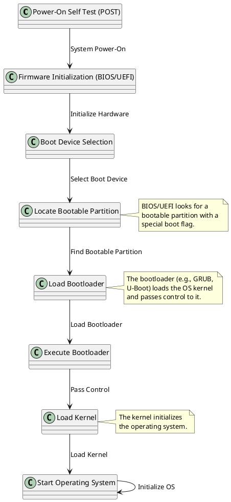

---
# `dd if=/dev/zero of=disk.img bs=1M count=128`
The command `dd if=/dev/zero of=disk.img bs=1M count=128` is used to create a blank disk image file. Here's a detailed breakdown of the command:

### Command Breakdown:

- `dd`: This is a Unix command used for converting and copying files. It can be used to create disk images, copy data, and perform low-level operations on files and devices.

- `if=/dev/zero`: This specifies the input file for `dd`. In this case, the input file is `/dev/zero`, which is a special file in Unix-like systems that provides as many null (zero value) bytes as are read from it. Essentially, it provides a stream of zero bytes.

- `of=disk.img`: This specifies the output file for `dd`. Here, the output file is `disk.img`, which will be the name of the disk image file created by the command.

- `bs=1M`: This sets the block size to 1 megabyte (MB). The block size is the amount of data `dd` reads and writes at a time. Setting a larger block size can make the operation faster by reducing the number of read/write operations.

- `count=128`: This specifies the number of blocks to copy. Since each block is 1 MB (as specified by `bs=1M`), copying 128 blocks will result in a file size of 128 MB.

### What Happens in Memory and Storage:

1. **Reading from /dev/zero:**
   - The `dd` command reads 128 blocks of 1 MB each from `/dev/zero`.
   - Each block contains zero bytes (null bytes).

2. **Writing to disk.img:**
   - The `dd` command writes the 128 MB of zero bytes to the file `disk.img`.
   - The result is a 128 MB file filled with zero bytes.

### Why This Step is Necessary:

- **Create a Blank Disk Image:**
  - This step creates a blank disk image file of a specific size (128 MB in this case). This file will serve as a virtual disk where you can create partitions, filesystems, and store data, mimicking a physical disk.
  
- **Preparation for Partitioning and Formatting:**
  - Before you can partition and format a disk (virtual or physical), you need to have a disk image file that represents the raw storage space. The `dd` command provides this by creating a file filled with zero bytes.

- **Emulating a Disk in QEMU:**
  - QEMU, the emulator used in this setup, can use disk image files like `disk.img` as virtual hard drives. Creating this file is the first step in preparing a virtual disk that QEMU can use to emulate storage for the virtualized RISC-V system.

In summary, the command `dd if=/dev/zero of=disk.img bs=1M count=128` creates a 128 MB file filled with zero bytes, which acts as a blank virtual disk for further operations like partitioning, formatting, and eventually using it as storage in the QEMU-emulated environment.

---
The commands `dd if=/dev/zero of=disk.img bs=128M count=1` and `dd if=/dev/zero of=disk.img bs=1M count=128` both create a file called `disk.img` with a size of 128 MB filled with zeros, but they differ in their approach to writing the file. Here’s a detailed comparison:

### Command Breakdown

1. **Command 1:**

   ```bash
   dd if=/dev/zero of=disk.img bs=128M count=1
   ```

   - **`if=/dev/zero`**: Input file is `/dev/zero`, which provides an endless stream of zero bytes.
   - **`of=disk.img`**: Output file is `disk.img`.
   - **`bs=128M`**: Block size is set to 128 MB.
   - **`count=1`**: Number of blocks to write is 1.

   **Effect:**
   - This command writes a single block of size 128 MB to `disk.img`.
   - The file `disk.img` will be exactly 128 MB in size.
   - Efficient for writing large blocks of data in a single operation.

2. **Command 2:**

   ```bash
   dd if=/dev/zero of=disk.img bs=1M count=128
   ```

   - **`if=/dev/zero`**: Input file is `/dev/zero`.
   - **`of=disk.img`**: Output file is `disk.img`.
   - **`bs=1M`**: Block size is set to 1 MB.
   - **`count=128`**: Number of blocks to write is 128.

   **Effect:**
   - This command writes 128 blocks, each of size 1 MB, to `disk.img`.
   - The file `disk.img` will be exactly 128 MB in size.
   - Results in 128 separate write operations of 1 MB each.

### Performance Considerations

- **Block Size:**
  - **`bs=128M`**: Larger block size may be more efficient in writing large files because it reduces the number of I/O operations.
  - **`bs=1M`**: Smaller block size means more frequent I/O operations, which could be less efficient but offers more granular control.

- **Write Efficiency:**
  - **`bs=128M count=1`**: Typically faster for large writes due to fewer I/O operations.
  - **`bs=1M count=128`**: May involve more overhead due to the increased number of I/O operations.

### Output File Comparison

Regardless of the command used, the resulting file `disk.img` will be:

- **Size:** 128 MB.
- **Content:** Filled with zeros.

### Example Outputs

**Using `bs=128M count=1`:**

```bash
dd if=/dev/zero of=disk.img bs=128M count=1
```

- **Size of `disk.img`:** 128 MB
- **File system:** Zeroed content.

**Using `bs=1M count=128`:**

```bash
dd if=/dev/zero of=disk.img bs=1M count=128
```

- **Size of `disk.img`:** 128 MB
- **File system:** Zeroed content, but written in 1 MB blocks.

### Summary

- Both commands achieve the same final result: a 128 MB file filled with zeros.
- `bs=128M count=1` is generally more efficient for large writes because it performs a single write operation.
- `bs=1M count=128` involves more frequent write operations but achieves the same final file size.
- In practice, the choice of block size can affect performance and speed depending on the system and use case.

---

In the context of creating a disk image file where efficiency and speed are considerations, the choice between using `bs=128M count=1` and `bs=1M count=128` depends on the specific needs and constraints of your use case. Here’s a breakdown of when to use each approach:

### When to Use `bs=128M count=1`

**Advantages:**
- **Faster Write Operation:** Writing a large block in a single operation (`128M`) can be more efficient because it reduces the number of I/O operations and system calls.
- **Reduced Overhead:** Fewer write operations mean less overhead in terms of both system and disk I/O, which can lead to faster execution.

**Use Cases:**
- **Large Disk Images:** When creating large disk images (e.g., for virtual machines) where speed is crucial.
- **Performance Testing:** If you are running performance tests and need to create disk images quickly.

**Example Command:**

```bash
dd if=/dev/zero of=disk.img bs=128M count=1
```

**Expected Outcome:**
- The `disk.img` file will be created with a size of 128 MB in one efficient write operation.

### When to Use `bs=1M count=128`

**Advantages:**
- **More Control:** Smaller block sizes can provide more granular control and flexibility, which may be useful in specific scenarios where fine-tuning is required.
- **Compatibility:** Some systems or tools may have limitations or specific requirements for block sizes.

**Use Cases:**
- **Smaller Disk Images:** When creating smaller disk images or when working with systems that require or work better with smaller block sizes.
- **Compatibility Testing:** If you need to test the behavior of disk images with different block sizes.

**Example Command:**

```bash
dd if=/dev/zero of=disk.img bs=1M count=128
```

**Expected Outcome:**
- The `disk.img` file will be created with a size of 128 MB, but the process involves multiple write operations (128 blocks of 1 MB each).

### Recommendations for Your Case

- **Efficiency and Speed:** If your primary concern is efficiency and speed, especially for larger disk images, using `bs=128M count=1` is generally better due to fewer write operations and reduced overhead.

- **Flexibility and Control:** If you need more control or are working with specific requirements related to block sizes, `bs=1M count=128` might be preferable.

### Summary

For creating a 128 MB disk image quickly and efficiently, **`dd if=/dev/zero of=disk.img bs=128M count=1`** is usually the preferred choice due to its simplicity and performance advantages. However, if you have specific needs or constraints, such as compatibility with certain tools or systems, you might opt for **`dd if=/dev/zero of=disk.img bs=1M count=128`**.


---

The command `sudo parted disk.img mklabel gpt` is used to create a new partition table on a disk image file (`disk.img`). Here’s a detailed breakdown of what this command does and why it's used:

### Command Breakdown

1. **`sudo`**:
   - **Function:** Runs the command with superuser (root) privileges.
   - **Reason:** Modifying disk images often requires elevated permissions to access and modify the file system.

2. **`parted`**:
   - **Function:** A disk partitioning tool used to create, modify, and delete disk partitions.
   - **Usage:** `parted` **works with both physical disks and disk image files.**

3. **`disk.img`**:
   - **Function:** The path to the disk image file you want to modify.
   - **Description:** This file acts as a virtual disk and will be treated by `parted` as if it were a real disk.

4. **`mklabel`**:
   - **Function:** Creates a new partition table on the disk.
   - **Description:** The `mklabel` command initializes a new partition table, which organizes the disk’s partitions.

5. **`gpt`**:
   - **Function:** Specifies the type of partition table to create.
   - **Description:** GPT stands for GUID Partition Table, which is a modern partitioning scheme offering several advantages over the older MBR (Master Boot Record) partitioning scheme.

### What This Command Does

1. **Initialize the Disk Image:**
   - The `mklabel gpt` part of the command initializes the partition table on the `disk.img` file.
   - This means the disk image will now have a GPT partition table structure, ready to hold partitions.

2. **GPT Partition Table:**
   - **GPT (GUID Partition Table):** A standard for partition tables on physical and virtual disks.
   - **Advantages:**
     - **Larger Disk Support:** Can handle disks larger than 2 TB, unlike MBR.
     - **More Partitions:** Supports up to 128 primary partitions on a disk (compared to MBR’s 4 primary partitions).
     - **Partition Redundancy:** GPT stores multiple copies of the partition table for increased reliability and recovery.

### Why You Need to Do This

1. **Preparation for Partitioning:**
   - Before creating partitions, you need to initialize the disk image with a partition table.
   - Without a partition table, you cannot define partitions or format them.

2. **Compatibility and Functionality:**
   - **GPT Partition Table:** Provides a modern and flexible way to manage disk partitions, essential for many contemporary operating systems and storage configurations.
   - **Virtual Disk:** Even though `disk.img` is a file, it needs a partition table to simulate a real disk’s structure for partitioning and formatting.

### Example Output

If you run the command successfully, you won’t see much output, but the partition table on the disk image file will be updated. You can verify the change using `parted` or other tools to check the disk’s partition table.

### Summary

- **Command:** `sudo parted disk.img mklabel gpt`
- **Purpose:** Initializes the disk image file `disk.img` with a GPT partition table.
- **Effect:** Prepares the disk image for partitioning by creating a new GPT partition table, which provides a modern, flexible structure for managing disk partitions.


---

The command `sudo losetup --find --show --partscan disk.img` is used to associate a loop device with a disk image file and scan it for partitions. Here’s a detailed breakdown of each part of the command and what it does:

### Command Breakdown

1. **`sudo`**:
   - **Function:** Executes the command with superuser (root) privileges.
   - **Reason:** Managing loop devices and partition tables typically requires elevated permissions.

2. **`losetup`**:
   - **Function:** A command used to set up and manage loop devices in Linux.
   - **Usage:** Loop devices allow a file to be treated as if it were a block device (like a hard drive).

3. **`--find`**:
   - **Function:** Automatically finds and assigns the next available loop device.
   - **Description:** Instead of specifying a loop device manually, this option lets `losetup` select the next unused loop device (e.g., `/dev/loop0`, `/dev/loop1`, etc.).

4. **`--show`**:
   - **Function:** Displays the name of the loop device that was assigned.
   - **Description:** After setting up the loop device, this option prints the device name to the terminal so you can see which loop device was used.

5. **`--partscan`**:
   - **Function:** Scans the loop device for partitions.
   - **Description:** After associating the loop device with the disk image, this option tells `losetup` to scan the device for partition tables and partitions. This makes the partitions available for use by the system.

6. **`disk.img`**:
   - **Function:** The path to the disk image file that will be associated with the loop device.
   - **Description:** This is the file that you want to mount as a loop device, allowing it to be accessed like a real disk.

### What This Command Does

1. **Create a Loop Device:**
   - **Associates `disk.img` with a loop device:** It effectively maps the `disk.img` file to a virtual block device.
   - **Example Output:** If the command successfully runs, it might output something like `/dev/loop0`, indicating the loop device assigned.

2. **Scan for Partitions:**
   - **Reads the partition table:** The `--partscan` option makes `losetup` scan the disk image for any defined partitions.
   - **Partitions Available:** Once scanned, the partitions defined in `disk.img` are made available as `/dev/loop0p1`, `/dev/loop0p2`, etc., depending on how many partitions were created.

3. **Display the Device Name:**
   - **Shows the Assigned Loop Device:** After setup, the command will display the loop device name that was used, so you know which device to interact with.

### Example Output

After running the command, you might see an output like:

```bash
/dev/loop0
```

This indicates that `disk.img` has been associated with `/dev/loop0`. If the image has partitions, they will be available as `/dev/loop0p1`, `/dev/loop0p2`, etc.

### Why You Need to Do This

1. **Access the Disk Image as a Block Device:**
   - **Mount and Manipulate Partitions:** Associating the image with a loop device allows you to mount the partitions, format them, or copy files to/from them.

2. **Partition and Format the Disk Image:**
   - **Using Tools:** Once the loop device is set up, tools like `parted`, `mkfs`, and `mount` can be used to manage partitions and file systems.

3. **Testing and Virtualization:**
   - **Testing Changes:** This is useful for testing partitioning and file system changes in a virtualized environment without affecting actual physical disks.

### Summary

- **Command:** `sudo losetup --find --show --partscan disk.img`
- **Purpose:** Sets up a loop device for the `disk.img` file, scans it for partitions, and shows the loop device name.
- **Effect:** Makes the disk image file accessible as a virtual block device and prepares it for partition and file system operations.


---

A loop device in Linux is a pseudo-device that allows a file to be treated as if it were a block device. This means that a regular file can be used in place of a physical disk or partition for various purposes, such as mounting file systems, creating disk images, or testing disk operations. Here’s a detailed explanation of what a loop device is and how it works:

### What is a Loop Device?

1. **Definition:**
   - A loop device is a virtual device that maps a file to a block device interface. It allows you to access the contents of a file as if it were a physical disk drive or partition.

2. **Functionality:**
   - **File as Disk:** With a loop device, you can use a file to emulate a disk or partition. For instance, if you have a file containing a filesystem image, you can mount it as if it were a real disk.
   - **Access and Manipulation:** This enables you to perform operations like mounting, partitioning, and formatting without needing actual physical hardware.

### How Loop Devices Work

1. **Creating a Loop Device:**
   - **Setup:** You use the `losetup` command to associate a loop device with a file. This creates a mapping between the file and a loop device node (e.g., `/dev/loop0`).
   - **Example Command:**
     ```bash
     sudo losetup /dev/loop0 disk.img
     ```
     Here, `/dev/loop0` is associated with the file `disk.img`.

2. **Using a Loop Device:**
   - **Mounting:** Once the loop device is set up, you can mount it as if it were a real disk:
     ```bash
     sudo mount /dev/loop0 /mnt
     ```
     This mounts the filesystem contained in `disk.img` to the `/mnt` directory.
   - **Partitioning and Formatting:** You can use partitioning tools (like `parted` or `fdisk`) and formatting tools (like `mkfs`) on the loop device to manage partitions and filesystems within the file.

3. **Loop Device Node:**
   - **Device Files:** Loop devices are represented as special device files in the `/dev` directory, such as `/dev/loop0`, `/dev/loop1`, etc. These nodes are managed by the Linux kernel and provide access to the virtual block device.

### Use Cases for Loop Devices

1. **Disk Images:**
   - **Testing and Development:** Create and manipulate disk images for testing without using physical disks.
   - **Virtual Machines:** Use loop devices to provide virtual disks for virtual machines.

2. **File Systems:**
   - **Mounting Filesystems:** Mount and access filesystems contained within files, useful for operations on disk images or backups.

3. **Software Testing:**
   - **Development:** Test filesystem and partitioning software using virtual disks.

### Example Commands

- **Create and Associate Loop Device:**
  ```bash
  sudo losetup --find --show disk.img
  ```
  This command automatically finds the next available loop device, associates it with `disk.img`, and prints the device name.

- **Unmount and Detach Loop Device:**
  ```bash
  sudo umount /dev/loop0
  sudo losetup -d /dev/loop0
  ```
  Unmounts the loop device and detaches it.

### Summary

- **Loop Device:** A virtual block device that maps a file to a block device interface.
- **Purpose:** Allows you to use files as if they were physical disks or partitions, facilitating operations like mounting, partitioning, and formatting.
- **Management:** Created and managed using tools like `losetup`, with device nodes found in `/dev`.

---

Inserting a new disk and creating a disk image are both ways to work with storage in a Linux environment, but they serve different purposes and involve different processes. Here’s a detailed comparison of each:

### Inserting a New Disk

**1. Purpose:**
   - **Physical Disk:** Inserting a new physical disk into the system to expand storage capacity or add new storage for use by the operating system.

**2. Detection and Setup:**
   - **Detection:** The new disk is detected by the Linux kernel as a new device node (e.g., `/dev/sda`, `/dev/sdb`).
   - **Partitioning:** Use tools like `fdisk`, `parted`, or `gparted` to create partitions on the new disk.
   - **Formatting:** Format each partition with a file system (e.g., ext4, xfs) using tools like `mkfs`.
   - **Mounting:** Mount the formatted partition to a directory (e.g., `/mnt/mydisk`) to access it.

**3. Commands and Tools:**
   - **Detection:** `lsblk`, `fdisk -l`
   - **Partitioning:** `fdisk /dev/sdX`, `parted /dev/sdX`
   - **Formatting:** `mkfs.ext4 /dev/sdX1`
   - **Mounting:** `mount /dev/sdX1 /mnt/mydisk`

**4. Use Cases:**
   - **Expansion:** Add additional physical storage to a system.
   - **Data Storage:** Use the new disk for storing files, backups, or data.

**5. Physical Hardware:**
   - **Direct Access:** The disk is physically connected to the machine and is managed by the operating system as a hardware device.

### Creating a Disk Image

**1. Purpose:**
   - **Virtual Disk Image:** Create a file that emulates a disk or partition. Used for purposes such as virtual machine disks, testing, or backups.

**2. Creation and Setup:**
   - **Create Image File:** Use tools like `dd` to create a file of a specified size that will act as the disk image.
   - **Partitioning and Formatting:** Use loop devices to access and partition the disk image file, then format it with a file system.
   - **Mounting:** Mount the loop device to access the contents of the disk image.

**3. Commands and Tools:**
   - **Create Image:** `dd if=/dev/zero of=disk.img bs=1M count=128`
   - **Setup Loop Device:** `sudo losetup --find --show disk.img`
   - **Partitioning (if needed):** `parted /dev/loop0`
   - **Formatting:** `mkfs.ext4 /dev/loop0p1`
   - **Mounting:** `mount /dev/loop0p1 /mnt/mydisk`

**4. Use Cases:**
   - **Virtualization:** Create virtual disks for use in virtual machines.
   - **Testing:** Test file systems and disk operations without using physical hardware.
   - **Backup:** Store disk images for backup or archival purposes.

**5. Virtual Hardware:**
   - **Emulated Device:** The disk image file is treated as a virtual block device via loop devices, and it does not require physical hardware.

### Key Comparisons

| Aspect                 | Inserting a New Disk                           | Creating a Disk Image                              |
|------------------------|------------------------------------------------|----------------------------------------------------|
| **Type of Device**     | Physical hardware                             | Virtual file (emulated as a block device)         |
| **Detection**          | Automatically detected by the kernel as `/dev/sdX` | Set up manually using loop devices (`/dev/loopX`) |
| **Partitioning**       | Tools like `fdisk`, `parted`                   | Tools like `parted`, `fdisk` on loop device       |
| **Formatting**         | `mkfs` on physical partitions                  | `mkfs` on loop device partitions                  |
| **Mounting**           | Mount physical partitions                     | Mount virtual partitions via loop device         |
| **Use Cases**          | Physical storage expansion, data storage      | Virtualization, testing, backup                  |
| **Hardware Requirement** | Requires physical disk hardware                | Does not require physical hardware                |

### Summary

- **Inserting a New Disk:** Involves adding physical hardware to the system, partitioning, formatting, and mounting it for use. It provides additional physical storage that can be directly accessed by the system.

- **Creating a Disk Image:** Involves creating a file that emulates a disk, using loop devices to interact with the file as if it were a real disk. This approach is useful for virtualization, testing, and backups without needing physical hardware.


The commands you provided use the `parted` utility to create partitions on a disk image file that is being accessed through a loop device. Here's a detailed explanation of each command:

### Overview

**Objective:** To partition a disk image file (`/dev/loop10`) into two partitions using the `parted` tool.

### Commands Explained

#### 1. `sudo parted --align minimal /dev/loop10 mkpart primary ext4 0 50%`

**Explanation:**

- **`sudo`:** Runs the command with superuser (root) privileges, which is required for modifying disk partitions.
- **`parted`:** A disk partitioning tool used to create, delete, and manage disk partitions.
- **`--align minimal`:** Specifies partition alignment. The `minimal` alignment setting aligns partitions to the minimal size, which may not be optimal for performance but is sometimes used for compatibility.
- **`/dev/loop10`:** The loop device representing the disk image file you are working with.
- **`mkpart`:** The command to create a new partition.
- **`primary`:** Specifies that the partition type is primary. On modern systems, the primary/extended distinction is less relevant, but it's still used in some contexts.
- **`ext4`:** The file system type for the partition. Although `parted` itself does not format the partition with ext4, it’s a label for reference. You will later format the partition with `mkfs.ext4`.
- **`0 50%`:** Defines the start and end points of the partition:
  - **`0`:** The starting point of the partition. In this case, it starts at the beginning of the disk image.
  - **`50%`:** The end point of the partition. This specifies that the partition should occupy the first 50% of the disk image.

**Result:** This command creates the first partition of the disk image, covering the first half (50%) of the disk.

#### 2. `sudo parted --align minimal /dev/loop10 mkpart primary ext4 50% 100%`

**Explanation:**

- **`sudo`:** Runs the command with superuser privileges.
- **`parted`:** The disk partitioning tool.
- **`--align minimal`:** Specifies minimal alignment for the partition.
- **`/dev/loop10`:** The loop device representing the disk image file.
- **`mkpart`:** Command to create a new partition.
- **`primary`:** Specifies that the partition type is primary.
- **`ext4`:** The file system type label for reference.
- **`50% 100%`:** Defines the start and end points of the partition:
  - **`50%`:** The starting point of the partition, beginning at the end of the first partition.
  - **`100%`:** The end point of the partition, covering the remaining 50% of the disk image.

**Result:** This command creates the second partition of the disk image, covering the remaining half (50%) of the disk.

### Summary of Partitions Created

- **Partition 1:**
  - **Size:** 50% of the disk image
  - **Start:** 0%
  - **End:** 50%
- **Partition 2:**
  - **Size:** 50% of the disk image
  - **Start:** 50%
  - **End:** 100%

### Additional Information

1. **Alignment:**
   - **Minimal Alignment:** Ensures that the partition boundaries are at the minimum alignment required, which may not be optimal for performance but ensures compatibility.

2. **Usage:**
   - **Partition 1:** You might format this partition and use it for specific data or system files.
   - **Partition 2:** Similarly, you can format this partition for other uses.

3. **Formatting:**
   - After creating the partitions, you need to format them with a file system (e.g., using `mkfs.ext4`), and then you can mount them to use them.

**Commands for Formatting (Example):**
```bash
sudo mkfs.ext4 /dev/loop10p1
sudo mkfs.ext4 /dev/loop10p2
```

**Commands for Mounting (Example):**
```bash
sudo mount /dev/loop10p1 /mnt/partition1
sudo mount /dev/loop10p2 /mnt/partition2
```

These commands allow you to manage the disk image as if it were a physical disk, creating partitions, formatting them, and mounting them for use.

---

The command `sudo parted /dev/loop10 set 1 boot on` is used to mark the first partition on the loop device `/dev/loop10` as a bootable partition. Here’s a detailed explanation of each part of the command:

### Command Breakdown

**1. `sudo`**

- **Purpose:** Executes the command with superuser (root) privileges.
- **Reason:** Modifying disk partitions and their attributes requires administrative permissions.

**2. `parted`**

- **Purpose:** A disk partitioning tool used to create, modify, and manage disk partitions.
- **Role in Command:** `parted` is used to manipulate the partition table of the disk image associated with the loop device.

**3. `/dev/loop10`**

- **Purpose:** Refers to the loop device that represents your disk image file. Loop devices are used to map a file to a block device, allowing you to treat the file as if it were a physical disk.

**4. `set 1 boot on`**

- **Purpose:** Modifies the attributes of a specific partition.
- **`1`:** Indicates the partition number. In this case, it refers to the first partition on the loop device (`/dev/loop10p1`).
- **`boot`:** Specifies the attribute to set. The `boot` flag marks the partition as bootable.
- **`on`:** Sets the `boot` flag to "on," marking the partition as bootable.

### What Happens During Execution

1. **Identify Partition:**
   - The command identifies partition `1` on the loop device `/dev/loop10`.

2. **Set Boot Flag:**
   - The `boot` flag is a special marker used to indicate that the partition is intended to be bootable. This is relevant for systems that use the partition to load the operating system.

3. **Update Partition Table:**
   - `parted` updates the partition table to include the boot flag for the specified partition.

### Why Set a Partition as Bootable?

- **Bootloader Usage:** For systems to boot from a partition, especially when using bootloaders like GRUB or U-Boot, the partition needs to be marked as bootable. The boot flag helps the bootloader or the system BIOS/UEFI to identify which partition to boot from.
- **Compatibility:** Some older BIOS systems or bootloaders require the boot flag to be set to recognize a partition as a bootable device. Modern systems often use EFI/UEFI and might not rely on the boot flag, but it's still a common practice in many setups.

### Example Usage

**To mark the first partition on a loop device as bootable:**

```bash
sudo parted /dev/loop10 set 1 boot on
```

**What this does:**
- Marks the first partition (`/dev/loop10p1`) as bootable within the partition table of the loop device.
- This is particularly important for creating bootable images where the operating system or bootloader will be loaded from this partition.

### Summary

- **Purpose:** Sets the `boot` flag on a partition to mark it as bootable.
- **Command:** `sudo parted /dev/loop10 set 1 boot on`
- **Effect:** Updates the partition table of the loop device to indicate that the specified partition is intended to be bootable, which is necessary for the partition to be used for booting the operating system.

---

Yes, the system BIOS or UEFI firmware plays a crucial role in initiating the boot process by locating and loading the bootloader from a designated bootable partition. Here’s a detailed overview of how this process works:

### Boot Process Overview

1. **Power-On Self Test (POST):**
   - When you power on the computer, the BIOS (Basic Input/Output System) or UEFI (Unified Extensible Firmware Interface) performs a series of tests to initialize hardware components and ensure everything is functioning correctly.

2. **Firmware Initialization:**
   - The BIOS or UEFI firmware initializes and configures system hardware, including the CPU, memory, and storage devices.

3. **Boot Device Selection:**
   - The firmware then determines the order of boot devices based on its configuration (e.g., HDD, SSD, USB, network). It looks for a bootable device in this order.

4. **Bootloader Discovery:**
   - The firmware searches the designated bootable partition of the selected boot device. The bootable partition is usually marked with a special flag (e.g., `boot` in MBR partitioning or the EFI System Partition in GPT).

5. **Loading the Bootloader:**
   - Once a bootable partition is found, the firmware loads the bootloader from this partition into memory. The bootloader is a small program responsible for starting the operating system. Common bootloaders include GRUB (Grand Unified Bootloader) and U-Boot.

6. **Bootloader Execution:**
   - The bootloader takes over control from the firmware. It typically performs the following tasks:
     - **Locate and Load the Kernel:** The bootloader locates the operating system kernel and loads it into memory.
     - **Pass Control to the Kernel:** After loading the kernel, the bootloader passes control over to it, allowing the kernel to start the operating system.
     - **Initialize Operating System:** The kernel initializes the rest of the operating system, including hardware drivers, system services, and user interfaces.

### Detailed Explanation

#### BIOS Boot Process

- **Boot Order:** The BIOS follows a boot order configured in the BIOS settings. It checks each device in the order specified until it finds a bootable partition.
- **Boot Sector:** In the case of MBR (Master Boot Record), the BIOS looks for the boot sector of the bootable partition. The boot sector contains the initial part of the bootloader code.
- **Loading and Execution:** The BIOS loads the bootloader code from the boot sector into memory and executes it.

#### UEFI Boot Process

- **Boot Order:** UEFI also follows a configured boot order but uses a more sophisticated approach than BIOS.
- **EFI System Partition (ESP):** UEFI systems use the EFI System Partition (ESP) which is a special partition formatted with FAT file system. The ESP contains bootloader files and boot configuration data.
- **Boot Manager:** UEFI includes a built-in boot manager that loads the bootloader from the ESP. The bootloader is typically an EFI executable file (e.g., `grubx64.efi` for GRUB).

### Summary

- **BIOS/UEFI Role:** Both BIOS and UEFI are responsible for initializing hardware, selecting boot devices, and locating the bootloader on a bootable partition.
- **Bootloader Execution:** The bootloader found on the bootable partition is then loaded into memory and executed. It starts the operating system by loading the kernel and handing over control to it.

By marking a partition as bootable and configuring the firmware correctly, you ensure that the system can locate and execute the bootloader, leading to the successful startup of the operating system.

--- 


Here's a PlantUML diagram to illustrate the boot process, focusing on the role of the BIOS/UEFI, bootloader, and kernel:



### Explanation of the Diagram

1. **Power-On Self Test (POST):**
   - System performs initial hardware checks and initialization.

2. **Firmware Initialization (BIOS/UEFI):**
   - BIOS or UEFI firmware initializes and configures hardware components.

3. **Boot Device Selection:**
   - Firmware selects the boot device based on the configured boot order.

4. **Locate Bootable Partition:**
   - Firmware searches the selected boot device for a partition marked as bootable.

5. **Load Bootloader:**
   - Firmware loads the bootloader from the bootable partition into memory.

6. **Execute Bootloader:**
   - The bootloader takes control, loads the operating system kernel, and prepares to pass control to it.

7. **Load Kernel:**
   - The bootloader loads the kernel into memory.

8. **Start Operating System:**
   - The kernel initializes and starts the operating system, completing the boot process.

This diagram represents the high-level sequence of events that occur during the boot process, from system power-on to OS startup.

--- 

Summary Boot flow:
Firmware find the bootable partion, load into memory and execute it. The bootable partion will load Kernel and start Operating system


Summary:
1. Create a region of memory of all 0 bits, consist of 128 blocks of 1MB
2. Create a GPT table for effective access that 128 blocks, set type = ext4
3. format each partitions with ext4 type, mode = ext4
4. Set partition 1 is bootable, the system BIOS/UEFI firmware will use bootloaders like GRUB or U-Boot to find the bootable partition and run that program inside that bootable partition
5. 

